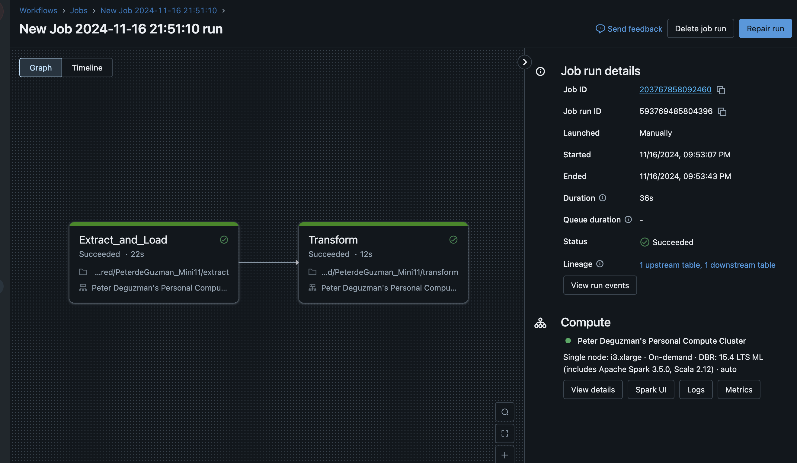
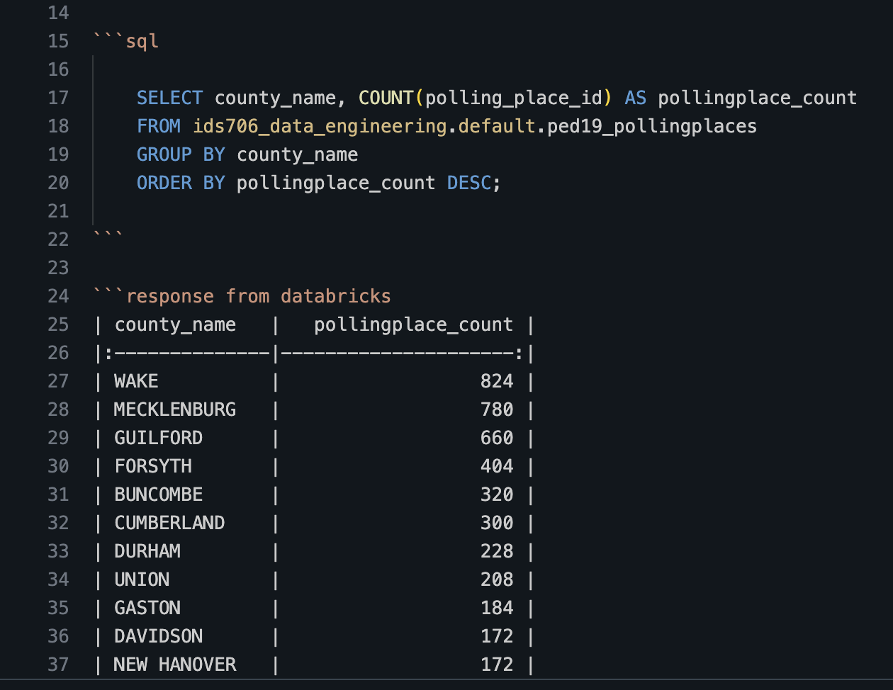

 # This is a README for IDS 706 Mini Project 11

### Status Badge:

## Summary and Project Motivation:
- The goal of this project was to create an ETL-Query (Extract, Transform, Load, Query) pipeline using Python and Databricks. 
- I extracted data from the NC State Board of Elections website and loaded the data into a Databricks Delta table. 
- Finally, I was able to establish a connection to Databricks and transform the data, building in functionality to run SparkSQL queries and log the output of each query as it ran.

### Data Used in this Project:
This project uses polling place data for elections in North Carolina.

More information and a link to the data is available at: 
- https://www.ncsbe.gov/results-data/polling-place-data

### Structure of ETL-Query Pipeline:
- In the `extract` notebook:
    - The `extract_load()` function takes in a URL, downloads the data, and loads it into a Delta table
- Next the `transform` notebook includes the `query()` function required to execute various SQL operations. This function's arguments are aSQL query formatted as a string and the path to the managed Delta table in the Unity Catalog. 
    - This script also includes a `log_query()` helper function that is included in the `general_query()` function to record the syntax and result of each SQL query. 

### Proof of Data Pipeline 
The data source (NCSBE website) is accessed through a URL. Data is extracted from the URL and loaded into a Delta table in the "extract" notebook. Then it is transformed and queried in the "transform" notebook. SQL query outputs are logged in the "query_log.md" file.

### Proof of Query and Explanation:

- This query retrieves data from our table (ped19_pollingplaces), counts the number of polling places by North Carolina county, and ranks them in descending order.

